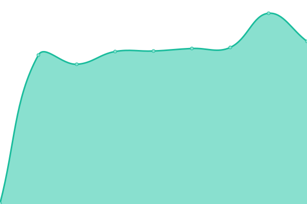

# [📈 Live Status](https://status.alex0.dev): <!--live status--> **🟩 All systems operational**

This repository contains the open-source uptime monitor and status page for [Alex Kuang](https://status.alex0.dev), powered by [Upptime](https://github.com/upptime/upptime).

With [Upptime](https://upptime.js.org), you can get your own unlimited and free uptime monitor and status page, powered entirely by a GitHub repository. We use [Issues](https://github.com/alexkuang0/status/issues) as incident reports, [Actions](https://github.com/alexkuang0/status/actions) as uptime monitors, and [Pages](https://status.alex0.dev) for the status page.

<!--start: status pages-->
<!-- This summary is generated by Upptime (https://github.com/upptime/upptime) -->
<!-- Do not edit this manually, your changes will be overwritten -->
<!-- prettier-ignore -->
| URL | Status | History | Response Time | Uptime |
| --- | ------ | ------- | ------------- | ------ |
|  [Homepage](https://alex0.dev) | 🟩 Up | [homepage.yml](https://github.com/alexkuang0/status/commits/HEAD/history/homepage.yml) | 

 262ms
     
 | 

<a href="https://status.alex0.dev/history/homepage">100.00%</a>
    

|  [RSS](https://rss.alex0.dev) | 🟩 Up | [rss.yml](https://github.com/alexkuang0/status/commits/HEAD/history/rss.yml) | 

 429ms
     
 | 

<a href="https://status.alex0.dev/history/rss">100.00%</a>
    

|  [Cloud Sync](https://cloud.alex0.dev) | 🟩 Up | [cloud-sync.yml](https://github.com/alexkuang0/status/commits/HEAD/history/cloud-sync.yml) | 

 2328ms
     
 | 

<a href="https://status.alex0.dev/history/cloud-sync">100.00%</a>
    

<!--end: status pages-->

[**Visit our status website →**](https://status.alex0.dev)

## 📄 License

- Powered by: [Upptime](https://github.com/upptime/upptime)
- Code: [MIT](./LICENSE) © [Alex Kuang](https://status.alex0.dev)
- Data in the `./history` directory: [Open Database License](https://opendatacommons.org/licenses/odbl/1-0/)
